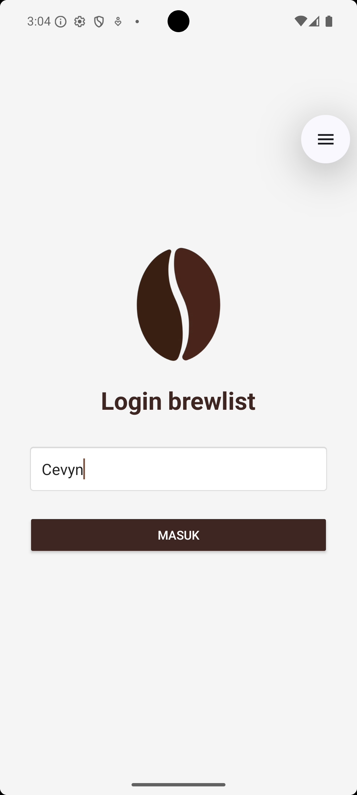
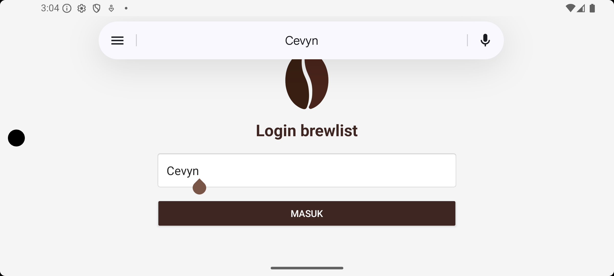
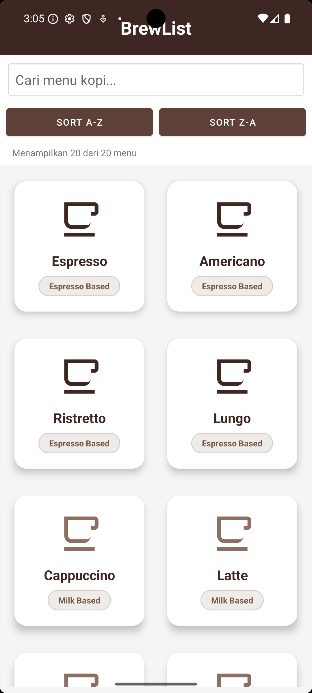
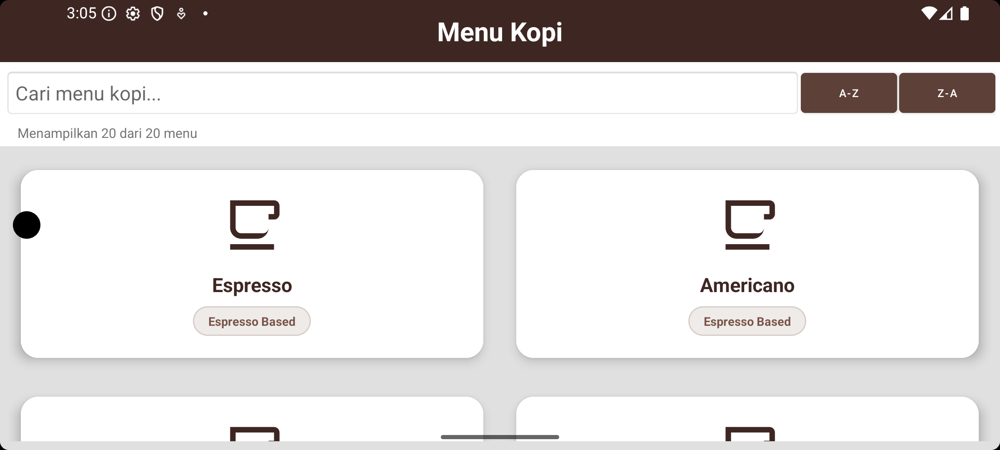
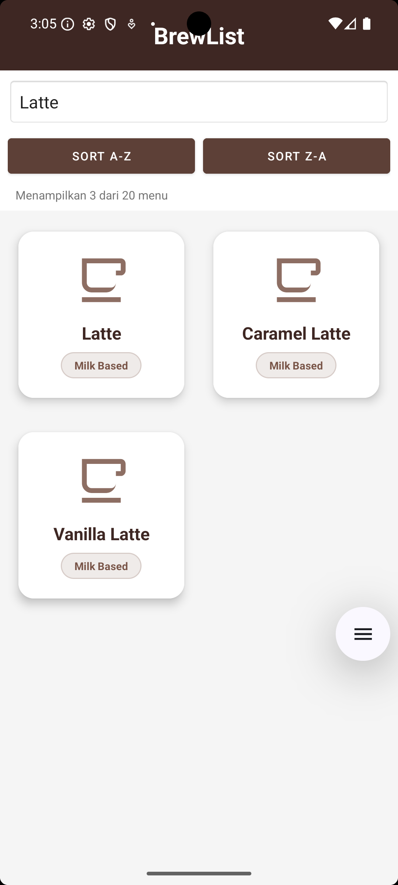
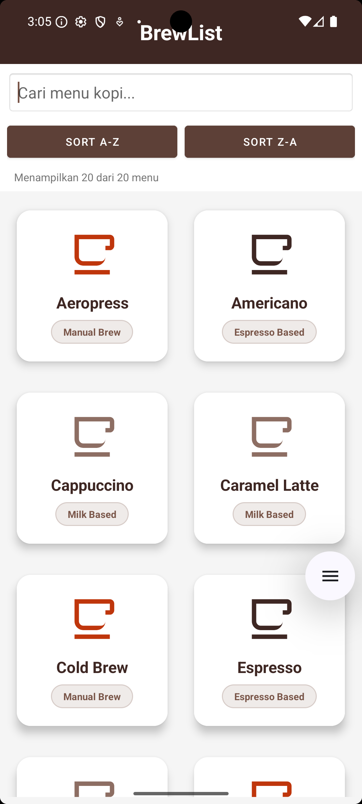
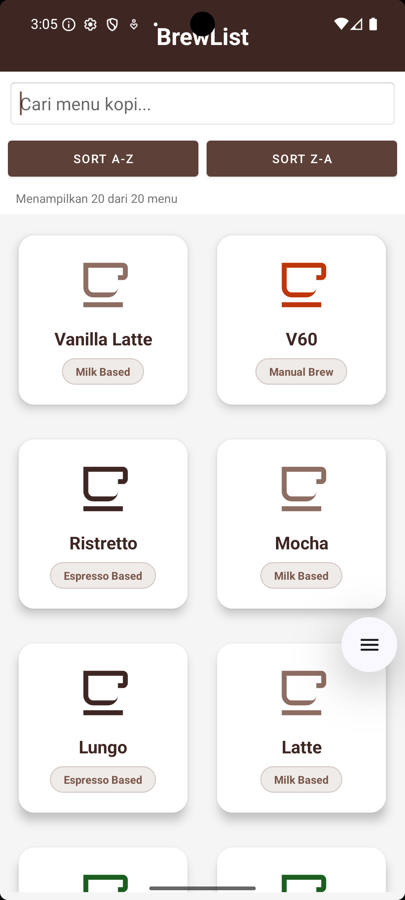
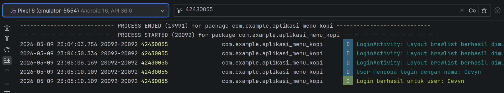

# UTS Pemrograman Seluler - Aplikasi Katalog Menu Kopi (brewlist)

## Identitas Mahasiswa
*   **Nama Lengkap:** I Made Obi Pranata
*   **NIM:** 42430055
*   **Program Studi:** Teknologi Informasi

## Deskripsi Aplikasi
**brewlist** adalah sebuah aplikasi Katalog Menu Kopi yang dirancang untuk memudahkan pengguna dalam menjelajahi berbagai varian menu kopi yang tersedia. Aplikasi ini menyajikan informasi menu dalam tampilan kartu yang modern dan responsif, dilengkapi dengan fitur pencarian dan pengurutan data untuk mempermudah navigasi pengguna.

Aplikasi ini dibangun untuk memenuhi Ujian Akhir Semester (UAS) mata kuliah Pemrograman Seluler. Aplikasi ini mendemonstrasikan penguasaan materi dari mata kuliah Pemrograman Seluler, meliputi:

*   **Modul 2 & 3:** Desain UI yang rapi dan Responsif (Wajib memiliki tampilan yang menyesuaikan saat layar HP di-landscape).
*   **Modul 4 & 5:** Terdapat perpindahan halaman (Intent) dan validasi If-Else pada kolom input.
*   **Modul 6:** Menggunakan struktur data Array dan mengimplementasikan fitur Pencarian Data (Linear Search).
*   **Modul 7:** Mengimplementasikan fitur Pengurutan Data dari A-Z dan Z-A menggunakan algoritma Bubble Sort.
*   **Modul 9:** Memiliki penanganan Error (try-catch) dan merekam aktivitas aplikasi di latar belakang menggunakan Logcat (Gunakan NIM 42430055 sebagai Tag Logcat).

## Screenshot Aplikasi

### 1. Halaman Login (Responsif)
| Mode Portrait | Mode Landscape |
| :---: | :---: |
|  |  |

### 2. Halaman Menu Kopi (Responsif)
| Mode Portrait | Mode Landscape |
| :---: | :---: |
|  |  |

### 3. Fitur Pencarian & Pengurutan (Sorting)
| Fitur Pencarian | Pengurutan A-Z | Pengurutan Z-A |
| :---: | :---: | :---: |
|  |  |  |

### 4. Monitoring Logcat (Tag: 42430055)

---
*Proyek ini dikembangkan menggunakan Android Studio dengan bahasa pemrograman Kotlin.*
